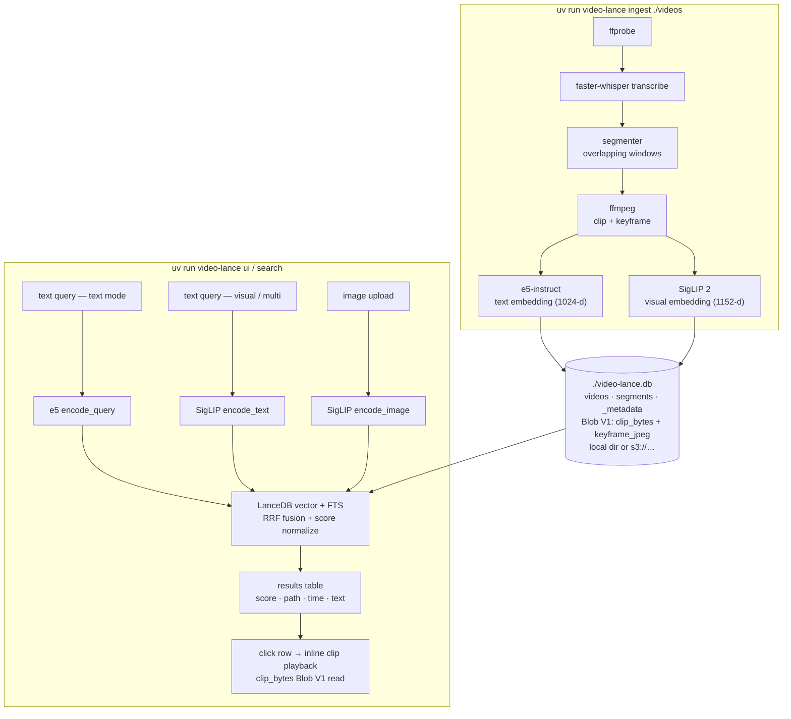

# video-lance

A Python pipeline that indexes a directory of videos into a LanceDB store with multi-modal embeddings, plus a Gradio UI for searching it.



## Status

| Session | Scope | State |
|---|---|---|
| 1 | Scaffold, `models.py`, `config.py`, `segmenter.py` | ✅ done |
| 2 | `probe.py`, `transcribe.py`, `clipper.py`, `frames.py`, fixture video | ✅ done |
| 3 | `embed_text.py` (e5-instruct), `embed_vision.py` (SigLIP 2), device autodetect | ✅ done |
| 4 | PyArrow schemas, LanceDB store with blob columns (Blob V1) | ✅ done |
| 5 | Stage protocol, pipeline orchestration, `video-lance ingest` CLI | ✅ done |
| 6 | Search (text / visual / multi), `info`, `reindex` | ✅ done |
| 7 | Gradio UI (`video-lance ui`) | ✅ done |

## Documentation

Detailed reference docs live in [`docs/`](docs/README.md):

- [architecture.md](docs/architecture.md) — module map, data model, Blob V1 storage, models/devices, config.
- [pipeline.md](docs/pipeline.md) — the eight ingest stages, idempotency, accurate clip/frame seeking, the embedding-model guard.
- [search.md](docs/search.md) — the three modes, RRF fusion, score normalization, indexing.
- [cli-and-ui.md](docs/cli-and-ui.md) — full CLI flag reference and the Gradio tabs.
- [development.md](docs/development.md) — tests, tooling, conventions, extending the pipeline.

[`CLAUDE.md`](CLAUDE.md) is a condensed agent-oriented guide to the same material.

## Requirements

- **Python 3.12+**
- **ffmpeg + ffprobe** on `PATH` (`brew install ffmpeg` on macOS)
- **[uv](https://docs.astral.sh/uv/)** for environment management
- Optional: GPU (CUDA / MPS) — pipeline auto-detects, falls back to CPU

## Quickstart

```bash
git clone <this repo>
cd lance-video
uv sync
uv run pytest -v     # 240 passed, 6 skipped, ~30s
```

### Ingest

```bash
uv run video-lance ingest ./videos \
    --segment-seconds 30 \
    --db-path ./video-lance.db
```

First run downloads Whisper + e5-instruct + SigLIP 2 weights to `~/.cache/huggingface` (~5–6 GB).

### Search from the CLI

```bash
uv run video-lance search "artificial intelligence" --mode text  --limit 5
uv run video-lance search "a person at a desk"      --mode visual --limit 5
uv run video-lance search --image ./query.jpg --mode visual
uv run video-lance search "computer chronicles"     --mode multi  --visual-weight 0.4
uv run video-lance info
uv run video-lance reindex
```

### Search from the web UI

```bash
uv run video-lance ui --db-path ./video-lance.db
# open http://127.0.0.1:7860
```

The UI is a Gradio Blocks app with three tabs:

**Search**
- **Free-form text query** — no menu, no pre-computed vectors. Each query is encoded server-side on click.
- **Mode switcher** — `text` (e5 + FTS hybrid), `visual` (SigLIP 2 cross-modal), `multi` (RRF blend of both).
- **Image upload** — drop in any image; SigLIP 2 encodes it and searches against `visual_embedding`.
- **SQL filter** — pass a `WHERE` expression like `duration_s > 60` straight to LanceDB.
- **Results table** — a `gr.Dataframe` of hits (`# · score · path · time · text`), rendered above the video player.
- **Inline clip playback** — click a row; the segment's `clip_bytes` blob column is read out, written to a tempfile, and fed to the `<video>` player with autoplay.

**Ingest** — run the full pipeline from the browser.
- Point at a videos directory, set include / exclude globs, hit **Discover** to preview the file list.
- All `SegmentationConfig` and `FrameSamplingConfig` knobs from the CLI, plus `--force`, are exposed as sliders / checkboxes.
- **Run ingest** kicks off a streaming generator that yields after each video: a live progress bar and a growing log keep you informed. **Cancel** terminates the generator (in-flight video finishes before the cancellation takes effect).
- Embedders + transcriber are loaded lazily on first run — the Search tab doesn't pay the Whisper load cost.

**Database** — administer the LanceDB store.
- Top: stats Markdown (row counts, persisted embedding model identifiers, every index on the segments table).
- Middle: videos dataframe; click a row to populate the segments dataframe below it.
- Danger zone (collapsed accordion): delete the selected video + its segments, gated by an "I understand…" checkbox.
- **Rebuild indexes** button = `video-lance reindex` (drops + creates FTS + IVF on both embedding columns).

## Repository layout

```
video-lance/
├── pyproject.toml
├── CLAUDE.md                      # condensed agent-oriented project guide
├── docs/                          # detailed reference docs (architecture, pipeline, search, cli-and-ui, development)
├── scripts/demo.sh                # one-shot ingest + search demo (CLI only)
├── src/video_lance/
│   ├── config.py                  # SegmentationConfig, FrameSamplingConfig, Config
│   ├── models.py                  # TranscriptWord, Transcript, VideoMeta
│   ├── device.py                  # autodetect_device / resolve_device
│   ├── segmenter.py               # compute_segments — pure, no I/O
│   ├── probe.py                   # ffprobe wrapper -> VideoMeta
│   ├── clipper.py                 # ffmpeg clip extraction -> mp4 bytes
│   ├── frames.py                  # ffmpeg single-frame extraction -> (jpeg, PIL.Image)
│   ├── transcribe.py              # faster-whisper wrapper + map_text_to_window
│   ├── embed_text.py              # e5-instruct (1024-d, L2-normalized)
│   ├── embed_vision.py            # SigLIP 2 (1152-d, L2-normalized, cross-modal)
│   ├── discovery.py               # walk dir, filter by include/exclude globs
│   ├── schema.py                  # PyArrow schemas + dim constants + blob tags (Blob V1)
│   ├── store.py                   # LanceDB connect / upsert / blob reads
│   ├── stages.py                  # Stage protocol + 8 concrete stages
│   ├── pipeline.py                # process_video / process_directory
│   ├── search.py                  # text / visual / multi + ensure_indexes + db_info
│   ├── ui_app.py                  # Gradio Blocks app + run_search / play_clip
│   └── cli.py                     # typer: ingest / search / info / reindex / ui
└── tests/                         # 240 tests (+ 6 opt-in integration tests)
    ├── _fakes.py                  # shared fake Whisper / e5 / SigLIP 2
    ├── conftest.py                # session-scoped fixture_video
    └── fixtures/make_fixture.py   # deterministic 10s color-bar + sine-wave video
```

## How the UI actually works

`run_search(ctx, query, mode, image, limit, sql_filter, visual_weight)` and `play_clip(ctx, raw_hits, selected_index)` are plain Python functions on `src/video_lance/ui_app.py`. They're independently unit-tested (`tests/test_ui_app.py`). Gradio is just the I/O layer:

- Submit / `Search` button → `run_search` → returns `(table_rows, raw_hits)` (the raw hits are stashed in a `gr.State`).
- `results_table.select` → `play_clip` reads the selected segment's `clip_bytes` blob and returns a tempfile path to the `gr.Video` component.

The Gradio import is at module top because Gradio's introspection calls `typing.get_type_hints()` on event handlers, and `gr.SelectData` annotations can't be resolved if `gr` is only bound inside a function. Once is enough; the CLI lazy-imports `ui_app.launch`, so the gradio import only fires when you actually launch the UI (or run the UI tests).

## Testing

```bash
uv run pytest -v                            # 240 passed, 6 skipped
uv run ruff check src tests                 # lint
uv run ruff format --check src tests scripts  # formatting gate
uv run ty check                             # static type check (Astral's `ty`)

# Coverage (branch + missing lines; baseline ~89% across the package).
uv run pytest --cov                         # terminal report
uv run pytest --cov --cov-report=html       # writes htmlcov/index.html

# Opt-in: hits the real model weights (~6 GB downloads on first run).
VL_INTEGRATION=1 uv run pytest tests/test_integration_real_models.py -v
```

Coverage is configured in `pyproject.toml` (`[tool.coverage.run]` / `[tool.coverage.report]`). `source = ["src/video_lance"]`, branch coverage on, and the usual sentinel lines (`if TYPE_CHECKING:`, `raise NotImplementedError`, `if __name__ == .__main__.:`, `pragma: no cover`) are excluded. The Gradio `build_app` / `launch` paths and the optional CUDA / MPS branches in `device.py` are the main uncovered regions — those need real hardware or a live server to exercise.

### pre-commit

```bash
uv run pre-commit install            # one-time: wires the git pre-commit hook
uv run pre-commit run --all-files    # run every hook against the whole tree
```

`.pre-commit-config.yaml` ships with:

- the standard hygiene hooks (`trailing-whitespace`, `end-of-file-fixer`, `check-yaml`, `check-toml`, `check-added-large-files`, `check-merge-conflict`, `mixed-line-ending`),
- `ruff-check --fix` and `ruff-format` (lint auto-fix + formatting on commit),
- `ty` (Astral's type checker, scoped to `src/` via `[tool.ty.src]`).

pytest is intentionally **not** a hook as the time it makes would make `git commit` painful. Run it explicitly, or wire it as a pre-push hook if you want to be safer.

Every Python module has unit tests against a deterministic 10 s color-bar fixture video. The model wrappers are tested with hash-based fakes (no real Whisper / e5 / SigLIP 2 weights downloaded during `pytest`). The opt-in integration suite loads the real models and is what would have caught the `sentencepiece` and `transformers 5.x ModelOutput` bugs earlier.

## Known limitations

- **Pipeline is sequential per video.** A `ProcessPoolExecutor` is the natural next step, but the embedder instances aren't easily pickleable, so adding it sensibly is a follow-up.
- **Free-form queries pay encoding cost on every search.** e5 ~50 ms, SigLIP 2 ~30 ms on warm CPU. Imperceptible to humans but worth noting if you go very high QPS.
- **SigLIP 2 is multilingual** (a big improvement over SigLIP 1, which was English-centric). Non-English `visual` / `multi` queries work reasonably; for transcript-over-transcript text search, e5-instruct remains the better encoder, which is why the `text` mode keeps using it.
- **Ingest re-encodes clips.** Stored clips are cut with frame-accurate seeking (`ClipStage` uses `precise=True`) so they line up with the transcript window, at the cost of a re-encode per segment. Clips written by older versions were stream-copied (keyframe-snapped) — re-ingest with `--force` to regenerate them.
- **Switching embedding models needs `--force`.** Ingesting a populated store with a different text/vision model is rejected (`EmbeddingModelMismatch`) to avoid mixing embedding spaces; a full `--force` re-ingest is required to switch.
