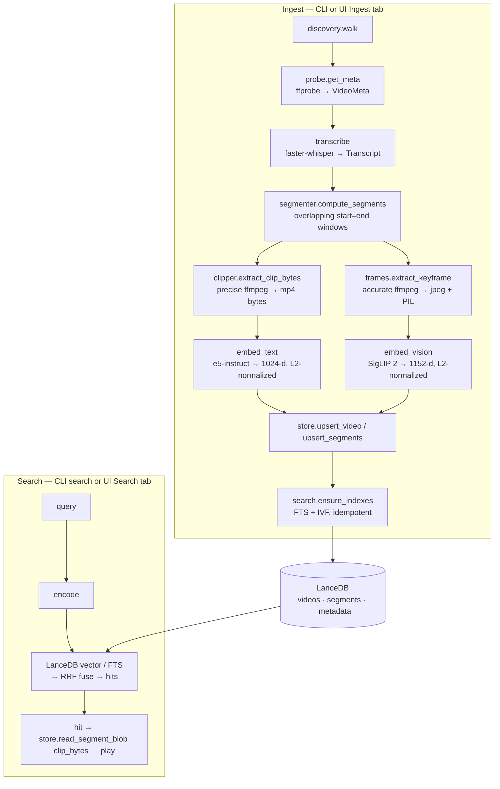

# Architecture

## Data flow

## Module map

Every module lives under `src/video_lance/`. They form a rough dependency
gradient from pure/leaf modules up to the orchestration and front ends.

| Layer | Module | Responsibility |
|---|---|---|
| Config & models | `config.py` | Pydantic `SegmentationConfig`, `FrameSamplingConfig`, `Config` (validation lives here). |
| | `models.py` | `TranscriptWord`, `Transcript`, `VideoMeta` value objects. |
| | `schema.py` | PyArrow schemas, embedding-dim constants, Blob V1 column tags, table names. |
| Leaf helpers (pure / thin I/O) | `device.py` | `autodetect_device` / `resolve_device` (`auto`→`cuda`/`mps`/`cpu`). |
| | `discovery.py` | Recursive dir walk with include/exclude globs. |
| | `segmenter.py` | `compute_segments` — pure, no I/O; windowing + sentence snapping. |
| ffmpeg wrappers | `probe.py` | `ffprobe` → `VideoMeta`. |
| | `clipper.py` | `ffmpeg` clip extraction → MP4 bytes (frame-accurate seek). |
| | `frames.py` | `ffmpeg` single-frame extraction → `(jpeg_bytes, PIL.Image)` (accurate seek). |
| Models (lazy, process-cached) | `transcribe.py` | faster-whisper wrapper + `map_text_to_window`. |
| | `embed_text.py` | e5-instruct wrapper (asymmetric query/passage prompting). |
| | `embed_vision.py` | SigLIP 2 wrapper (shared text/image space, cross-modal). |
| Storage | `store.py` | LanceDB connect / upsert / blob reads / metadata / embedding-model guard. |
| Orchestration | `stages.py` | `Stage` protocol + eight concrete stages + `PipelineContext`. |
| | `pipeline.py` | `process_video` / `process_directory`. |
| Retrieval | `search.py` | `search_text` / `search_visual` / `search_multi`, RRF, `ensure_indexes`, `db_info`. |
| Front ends | `cli.py` | Typer app: `ingest` / `search` / `info` / `reindex` / `ui`. |
| | `ui_app.py` | Gradio Blocks app + testable `run_search` / `play_clip`. |

## Data model

Three tables, defined in `schema.py` and opened/created idempotently by
`store.ensure_tables`.

### `videos` — one row per ingested file
`video_id` (PK), `source_path`, `relative_path`, `duration_s`, `fps`,
`width`, `height`, `codec`, `size_bytes`, `ingested_at`, `segment_seconds`,
`overlap_seconds`, `transcript_full`.

`segment_seconds` / `overlap_seconds` are stored so a re-ingest can detect
whether the segmentation config changed (see [pipeline.md](pipeline.md#idempotency)).

### `segments` — one row per time window
`segment_id` (PK), `video_id` (FK), `idx`, `start_s`, `end_s`, `keyframe_t_s`,
`text`, `text_embedding` (fixed-size list, 1024), `visual_embedding`
(fixed-size list, 1152), `clip_bytes` (**Blob V1**), `keyframe_jpeg`
(**Blob V1**).

### `_metadata` — free-form key/value
Currently persists the two embedding-model identifiers the store was built with
(`text_embed_model`, `vision_embed_model`). This is what `info` reports and what
the [embedding-model guard](pipeline.md#embedding-model-guard) checks on
re-ingest.

### Identifiers
- `video_id = sha256(abspath)[:16]` — stable per absolute path. Moving the file
  invalidates the ID (a content-hash scheme is a known future upgrade).
- `segment_id = f"{video_id}:{idx:06d}"`.

## Blob V1 storage

`clip_bytes` and `keyframe_jpeg` are `pa.large_binary()` fields tagged with
`{"lance-encoding:blob": "true"}` (`schema._BLOB_METADATA`). Lance stores the
payload **out-of-line**; the column holds descriptors, not raw bytes, so large
binaries don't bloat columnar scans.

Consequence: a normal read returns descriptors, **not** the bytes. To get bytes
back, `store.read_segment_blob(tables, segment_id, column)` resolves the segment
to its Lance `_rowid`, then calls `Dataset.take_blobs(column, ids=[rowid])`. The
UI uses this to render keyframes and to materialize a clip to a tempfile for the
`<video>` element.

> Blob V2 (inline/packed/dedicated/external, Lance file format 2.2+) is a future
> upgrade, currently gated on `lancedb`'s `create_table` still pinning format
> 2.1. `BLOB_COLUMNS` in `store.py` is the allow-list of blob columns.

## Models and devices

Three model families, all loaded **lazily** (imports of `video_lance` do not
drag in torch) and **process-cached** by a `(model_name, device)` (or
`(model_name, device, compute_type)`) key:

| Wrapper | Default checkpoint | Output | Loader |
|---|---|---|---|
| `WhisperTranscriber` | `small.en` (faster-whisper) | word-timestamped transcript | `get_transcriber` |
| `E5Embedder` | `intfloat/multilingual-e5-large-instruct` | 1024-d, L2-normalized | `get_text_embedder` |
| `SigLIPEmbedder` | `google/siglip2-so400m-patch14-384` | 1152-d, L2-normalized | `get_vision_embedder` |

- **e5 is asymmetric**: passages are encoded as-is; queries are wrapped as
  `Instruct: {task}\nQuery: {query}`. Vectors are L2-normalized so cosine
  similarity equals the dot product.
- **SigLIP 2 shares an embedding space** across its text and image towers, so a
  text query (`encode_text`) can be compared directly against stored image
  vectors (`encode_image`). This is what powers `visual` and `multi` search.
- Embedding dimensions are single-sourced in `schema.py` (`TEXT_EMBED_DIM`,
  `VISION_EMBED_DIM`) and re-exported by the embedder modules; `SegmentRow`
  validates them in `__post_init__`.
- **Device**: `resolve_device("auto")` prefers `cuda`, then `mps`, then `cpu`.
  `cuda`/`mps`/`cpu` pass through; anything else raises.

## Config surface

`Config` (in `config.py`) is built directly from CLI flags / UI widgets — it is
not read from a file. Notable validation:

- `SegmentationConfig`: `segment_seconds > 0`, `overlap_seconds >= 0`, and a
  model-level check that `segment_seconds - overlap_seconds > 0` (the step must
  be positive or windowing would never advance).
- `FrameSamplingConfig`: `position` is clamped to `[0, 1]`; `jpeg_quality` in
  `[1, 100]`; `max_long_edge > 0`.
- `Config` also carries the model identifiers, `device`, `db_path`, include /
  exclude globs, and `workers`.
