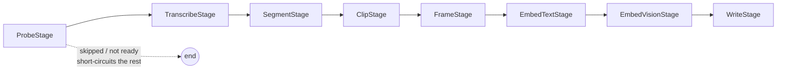

# The ingest pipeline

Ingest is a linear chain of **stages** run per video. `pipeline.process_video`
builds a fresh `PipelineContext`, then walks `DEFAULT_STAGES` in order; each
stage mutates the context in place. `pipeline.process_directory` discovers files
under a root, runs `process_video` on each, and (by default) builds the search
indexes once at the end.



## The stage protocol

A `Stage` (see `stages.py`) is any object with:

```python
name: str
def is_ready(self, ctx: PipelineContext) -> bool: ...
def run(self, ctx: PipelineContext) -> StageResult: ...
```

The driver loop is deliberately simple:

```python
for stage in chain:
    if not stage.is_ready(ctx):
        break          # first not-ready stage ends the run for this video
    stage.run(ctx)
```

`is_ready` returning `False` short-circuits the rest of the chain. The most
common reason is the idempotency skip (below): `ProbeStage` sets `ctx.skipped`,
and every downstream stage's `is_ready` checks `not ctx.skipped`. Any exception
in a stage is caught per-video by `process_video` and reported as a failed
`ProcessResult` — one bad file doesn't abort the batch.

## The eight stages

| # | Stage | What it does | Writes to context |
|---|---|---|---|
| 1 | `ProbeStage` | `ffprobe` the file; run the idempotency check. | `ctx.meta`, maybe `ctx.skipped` |
| 2 | `TranscribeStage` | faster-whisper with word timestamps. | `ctx.transcript` |
| 3 | `SegmentStage` | `compute_segments` → windows; map transcript text into each window; pick each keyframe time. | `ctx.segments` |
| 4 | `ClipStage` | Extract a **precise** MP4 clip per segment. | `s.clip_bytes` |
| 5 | `FrameStage` | Extract the keyframe JPEG + PIL image per segment. | `s.keyframe_jpeg`, `s.frame_image` |
| 6 | `EmbedTextStage` | e5 `encode_passages` over segment texts. | `s.text_embedding` |
| 7 | `EmbedVisionStage` | SigLIP `encode_images` over keyframes. | `s.visual_embedding` |
| 8 | `WriteStage` | Build `VideoRow` + `SegmentRow`s and upsert. | LanceDB |

The embed stages assert the returned vector count matches the segment count, and
`WriteStage.is_ready` only fires once every segment has a clip, a keyframe, and
both embeddings — so a partial context never gets written.

## Idempotency

`ProbeStage` computes `video_id_for_path` and looks for an existing `videos`
row. If one exists **and** its `segment_seconds` / `overlap_seconds` match the
current config (within `1e-6`), the video is marked `skipped` and downstream
stages no-op. If the segmentation config differs, it re-segments (the
`upsert_segments` delete-then-add is scoped per `video_id`, so stale rows are
cleaned up). `--force` bypasses the skip entirely.

## Segmentation

`segmenter.compute_segments(duration_s, cfg, transcript)` is pure. It produces
overlapping `[start, end)` windows with `step = segment_seconds - overlap_seconds`,
then optionally:

- **Merges a short tail** (`merge_short_tail`, `min_tail_seconds`): if the final
  window is shorter than `min_tail_seconds`, it's folded into the previous one.
- **Snaps to sentences** (`sentence_snap_tolerance_seconds > 0`): window
  boundaries move to the nearest sentence-ending word within tolerance, using
  the transcript's `is_sentence_end` words.

`transcribe.map_text_to_window(transcript, start, end)` assigns each window its
text: a word belongs to the window if `[w.start, w.end)` overlaps `[start, end)`.
Because windows overlap, adjacent segments can share boundary words — expected.

## Accurate clip and frame extraction

Both `clipper` and `frames` seek **frame-accurately** so a stored clip/keyframe
lines up with the exact `[start, end)` window (and therefore with the transcript
text mapped to that window).

- **Naive fast seek** (`-ss` before `-i` with `-c copy`) snaps to the nearest
  keyframe *before* the timestamp — on long-GOP video that can be seconds early,
  which is what causes "the audio doesn't match the caption."
- **The fix** (`_accurate_seek_args` in `clipper.py`, `_seek_args` in
  `frames.py`): for small offsets, output-seek from the start (`-i PATH -ss t`),
  which is exact; for large offsets, do a coarse input seek to
  `t - WINDOW` then a fine output seek of the remainder — accurate *and* fast.
- `ClipStage` calls `extract_clip_bytes(..., precise=True)`, so clips are
  re-encoded (libx264 `veryfast` / aac) with the accurate seek rather than
  stream-copied. Stream copy remains available (`precise=False`) for callers who
  want speed and can tolerate keyframe-snapped starts.

> Because the clip encoding changed, clips ingested by older versions are still
> keyframe-snapped. Re-ingest with `--force` to regenerate them.

## Embedding-model guard

Embedding columns are fixed-dimension, so writing vectors from a *different*
model that happens to share the dimension would silently corrupt search. To
prevent that, both ingest paths call
`store.assert_or_set_embedding_models(tables, text_embed_model=..., vision_embed_model=..., force=...)`:

- On a fresh store, it records the identifiers in `_metadata`.
- On a populated store, it raises `store.EmbeddingModelMismatch` if either
  requested model differs from the stored one — unless `force=True`, which
  overwrites the identifiers (the caller is then responsible for a full
  `--force` re-ingest so every segment is re-embedded consistently).

The CLI surfaces the mismatch as a non-zero exit; the UI Ingest tab yields an
`ingest aborted: …` log line and stops.

## Auto-indexing

After a batch with at least one successful write, `process_directory` calls
`search.ensure_indexes(replace=False)` so the first `text`-mode query doesn't hit
"no INVERTED index" and vector search is accelerated once the table is large
enough. It's idempotent — existing indexes are reported as `exists`. See
[search.md](search.md#indexing) for the details.
